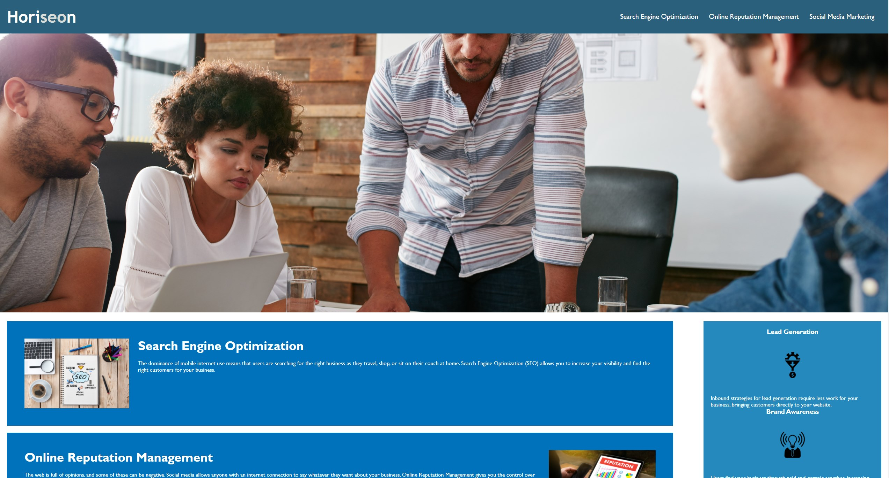
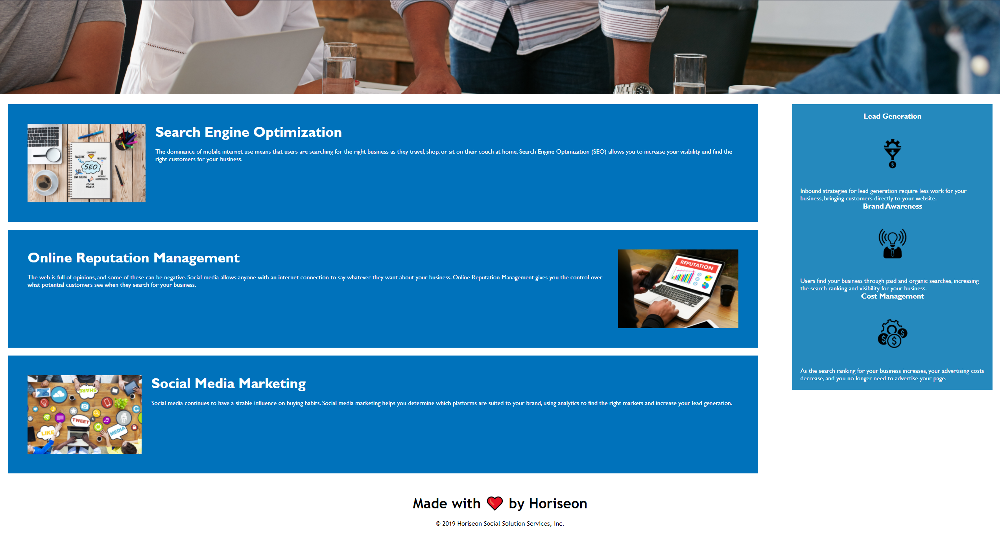

# Code Refactor Challenge

## Overview

This bit of code was created for the Full Stack boot camp for the UW system as our first challenge assigned to us. With this challenge I was required to refactor existing code for a fictitious to make the website more accessible and improve SEO, as well as help the company's website be within accessibility standards. By consolidating the code any other coder to be able to review my work and quickly understand what is being accomplished.

See below pictures of this work.

Thank you for reading the ReadMe!